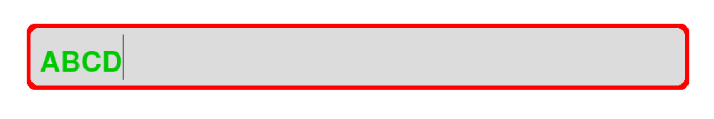

# TextBox

A box for text input or display



## Example Usage

```Python
import pygame
from pygame_widgets import TextBox


def output():
    # Get text in the textbox
    print(textbox.getText())


pygame.init()
win = pygame.display.set_mode((1000, 600))

textbox = TextBox(win, 100, 100, 800, 80, fontSize=50,
                  borderColour=(255, 0, 0), textColour=(0, 200, 0),
                  onSubmit=output, radius=10, borderThickness=5)

run = True
while run:
    events = pygame.event.get()
    for event in events:
        if event.type == pygame.QUIT:
            pygame.quit()
            run = False
            quit()

    win.fill((255, 255, 255))

    textbox.listen(events)
    textbox.draw()

    pygame.display.update()
```

## Optional Parameters

| Parameter | Description | Type | Default |
| :---: | --- | :---: | :---: |
| colour | Background colour. | (int, int, int) | (220, 220, 220) |
| textColour | Colour of text. | (int, int, int) | (0, 0, 0) |
| borderColour | Colour of border. | (int, int, int) | (0, 0, 0) |
| borderThickness | Thickness of border. | int | 3 |
| radius | Border radius. Set to 0 for no radius. | int | 0 |
| onSubmit | Function to be called when return / enter is pressed. | function | None |
| onSubmitParams | Parameters to be fed into onSubmit function. | (*any) | () |
| placeholderText | Text to be displayed when empty. | str | '' |
| fontSize | Size of text. | int | 20 |
| font | Font of text. | pygame.font.Font | Calibri