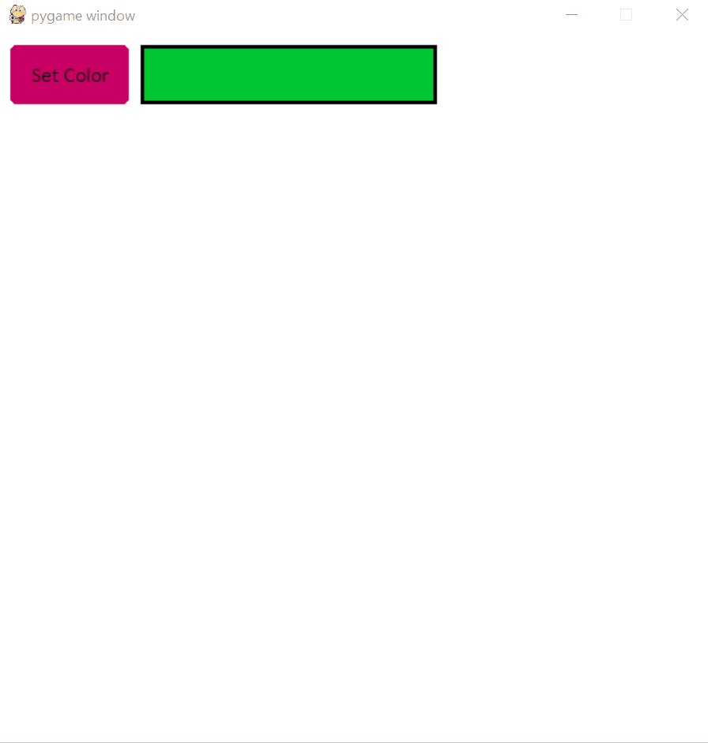

# ComboBox

A dropdown menu allowing the selection of various elements using a search bar.

It is similar to `Dropdown` but includes a `TextBox` that allows searching of options.

The parameters of the `TextBox` can be made different
from the ones of the dropdown if they are specified in
the `textboxKwargs` parameter.



```Python
import pygame_widgets
import pygame

from pygame_widgets.combobox import ComboBox
from pygame_widgets.button import Button

pygame.init()
win = pygame.display.set_mode((600, 600))

comboBox = ComboBox(
    win, 120, 10, 250, 50, name='Select Color',
    choices=pygame.colordict.THECOLORS.keys(),
    maxResults=4,
    font=pygame.font.SysFont('calibri', 30),
    borderRadius=3, colour=(0, 200, 50), direction='down',
    textHAlign='left'
)


def output():
    comboBox.textBar.colour = comboBox.getText()


button = Button(
    win, 10, 10, 100, 50, text='Set Colour', fontSize=30,
    margin=15, inactiveColour=(200, 0, 100), pressedColour=(0, 255, 0),
    radius=5, onClick=output, font=pygame.font.SysFont('calibri', 18),
    textVAlign='bottom'
)

run = True
while run:
    events = pygame.event.get()
    for event in events:
        if event.type == pygame.QUIT:
            pygame.quit()
            run = False
            quit()

    win.fill((255, 255, 255))

    pygame_widgets.update(events)
    pygame.display.update()
```

This is a classic combo box. The current selected text
can be accessed through the `getText()` methods.

It returns the current text in the search bar.


## Mandatory Parameters

_Note: Mandatory parameters must be supplied in order._

| Parameter | Description | Type |
| :---: | --- | :---: |
| choices | Choices to appear in the list | list of str |

## Optional Parameters

| Parameter | Description | Type | Default |
| :---: | --- | :---: | :---: |
| direction | Expansion direction. Can be 'down', 'up', 'left' or 'right'. | str | down |
| inactiveColour | Default colour when not pressed or hovered over. | (int, int, int) | (150, 150, 150) |
| pressedColour | Colour when pressed. | (int, int, int) | (100, 100, 100) |
| hoverColour | Colour when hovered over. | (int, int, int) | (125, 125, 125) |
| maxChoices | Maximum number of choices to display | int | len(choices) |
| searchAlgo | Algorithm to be used to search through choices. | function(str, list) -> list | ComboBox._defaultSearch |
| onSelected | Function to be called when a search choice is selected. | function | None |
| onSelectedParams | Parameters to be fed into onSelected function. | (*any) | () |
| onStartSearch | Function to be called when a search is started by user (clicking on the search box). | function | None |
| onStartSearchParams | Parameters to be fed into onStartSearch function. | (*any) | () |
| onStopSearch | Function to be called when a search is stopped (clicking outside the search dropdown, or selecting a choice). | function | None |
| onStopSearchParams | Parameters to be fed into onStopSearch function. | (*any) | () |
| textColour | Colour of text. | (int, int, int) | (0, 0, 0) |
| fontSize | Size of text. | int | 20 |
| font | Font of text. | pygame.font.Font | sans-serif |
| textHAlign | Horizontal alignment of text. Can be 'centre', 'left' or 'right'. | str | 'centre' |
| borderColour | Colour of border. | (int, int, int) | (0, 0, 0) |
| borderThickness | Thickness of border. | int | 3 |
| borderRadius | Border radius. Set to 0 for no radius. | int | 0 |
| textboxKwargs | Optional different parameters only for the `TextBox`. | dict | {} |
