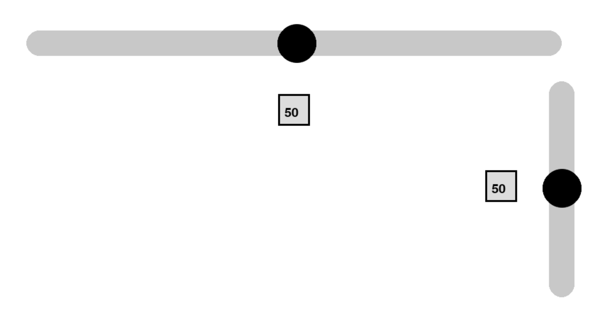

# Slider

A slider for discrete numeric value selection



## Example Usage

```Python
import pygame_widgets
import pygame
from pygame_widgets.slider import Slider
from pygame_widgets.textbox import TextBox

pygame.init()
win = pygame.display.set_mode((1000, 600))

slider = Slider(win, 100, 100, 800, 40, min=0, max=99, step=1)
output = TextBox(win, 475, 200, 50, 50, fontSize=30)

output.disable()  # Act as label instead of textbox

run = True
while run:
    events = pygame.event.get()
    for event in events:
        if event.type == pygame.QUIT:
            pygame.quit()
            run = False
            quit()

    win.fill((255, 255, 255))

    output.setText(slider.getValue())

    pygame_widgets.update(events)
    pygame.display.update()
```

As you can see, TextBox can be used to display text as well, by not calling its listen method.

## Optional Parameters

| Parameter | Description | Type | Default |
| :---: | --- | :---: | :---: |
| min | Minimum value of the slider (left). | int or float | 0 |
| max | Maximum value of the slider (right). | int or float | 99 |
| step | Value to increment by. | int or float | 1 |
| colour | Colour of slider. | (int, int, int) | (200, 200, 200) |
| handleColour | Colour of handle. | (int, int, int) | (0, 0, 0) |
| initial | Initial value of the slider. | int or float | Average of min and max |
| handleRadius | Radius of handle. | int | height / 1.3 |
| curved | Add curved ends to the slider. | bool | True |
